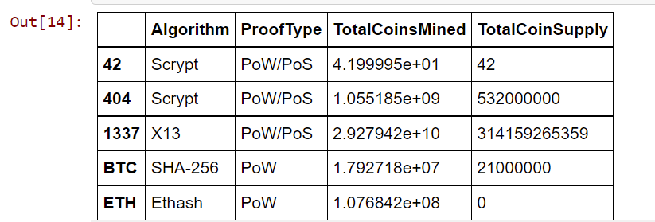
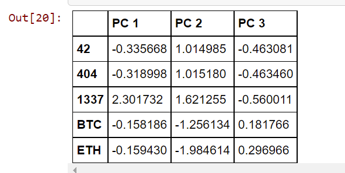
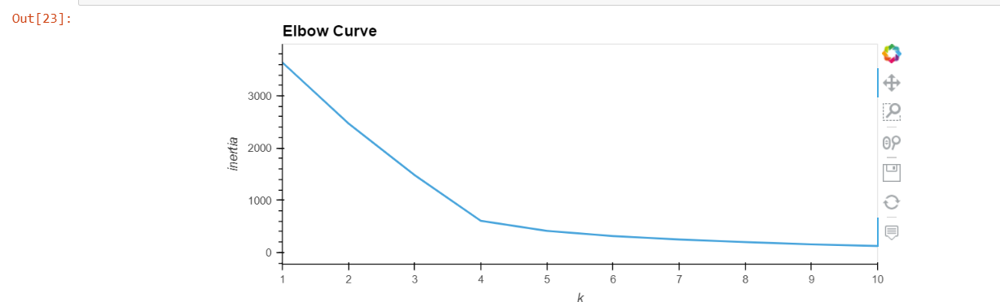
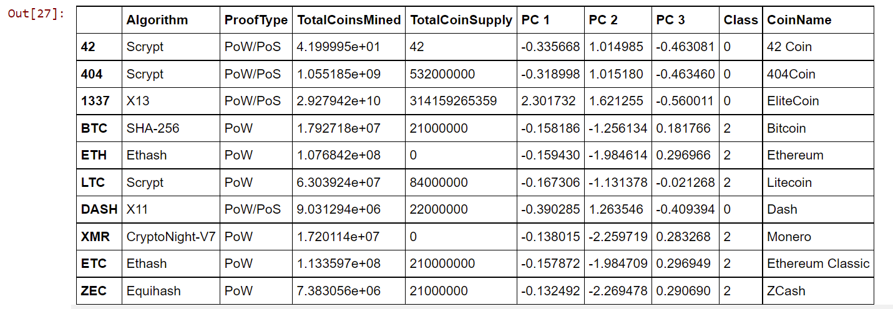
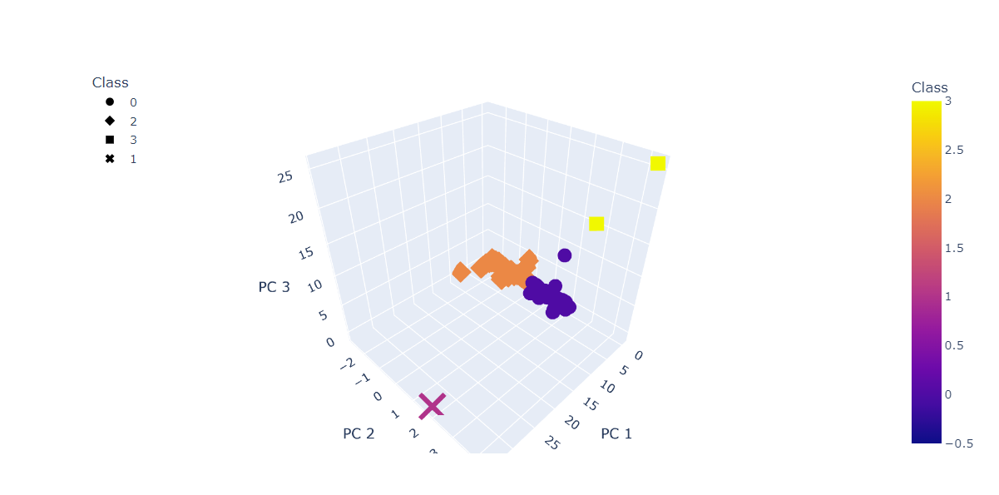
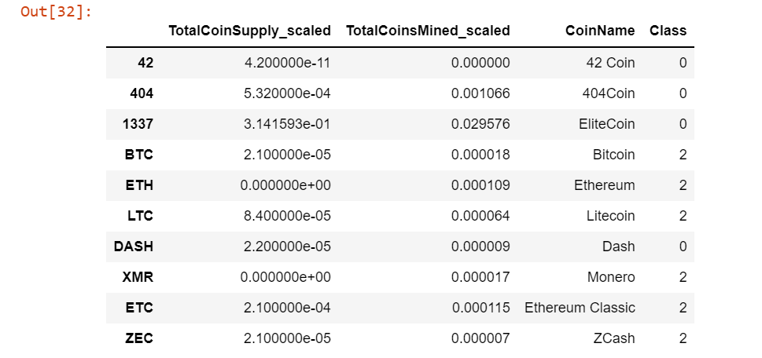
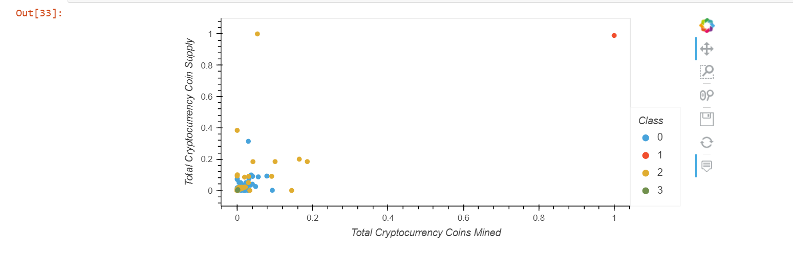

# Cryptocurrencies

## Deliverable 1:

### Preprocessing the Data for PCA

## Deliverable 2:

### Reducing Data Dimensions Using PCA

## Deliverable 3:

### Clustering Cryptocurrencies Using K-means

## Deliverable 4:

### Visualizing Cryptocurrencies Results

